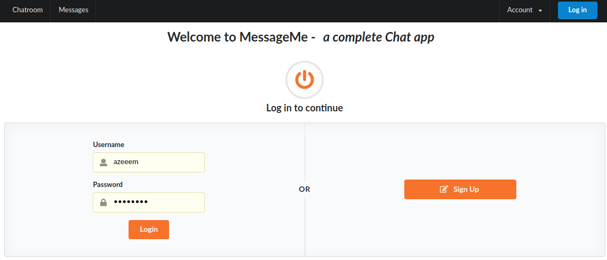

# Message me app - Group chat with your friends

> Chat with your friends in a global chatroom!

Created with Ruby on Rails.

## Built With

- Ruby on Rails
- Bcrypt for authentication
- Semantic-ui for styling
- Redis
- Databases: SQLite3 in development and testing, PostgresQL for production

## Live Demo

- [Live Demo Link](https://stark-retreat-25349.herokuapp.com/)

## Getting Started

To get a local copy up and running follow these simple example steps.

### Prerequisites

1. Have ruby installd
2. Have Rails 5 insalled

### Setup

1. Clone this repo to your computer using <code>git clone</code> and the web url
2. Open your terminal and <code>cd</code> into the project root directory

### Install

1. Run <code>bundle install</code>
2. Install yarn packages as the terminal will prompt you to do
3. Run <code>rails db:create</code>
4. Run <code>rails db:migrate</code>
5. Run <code>Rails s</code> to start the server

### Usage

1. Open your browser at <code>localhost:3000</code>
2. Sign up and start chatting with your friends!

## Authors

👤 **Azeem Ahmed**

- Github: [@Azeem838](https://github.com/Azeem838)

## 🤝 Contributing

Contributions, issues and feature requests are welcome!

Feel free to check the [issues page](https://github.com/Azeem838/message-me/issues).

## Show your support

Give a ⭐️ if you like this project!

## 📝 License

This project is [MIT](lic.url) licensed.
